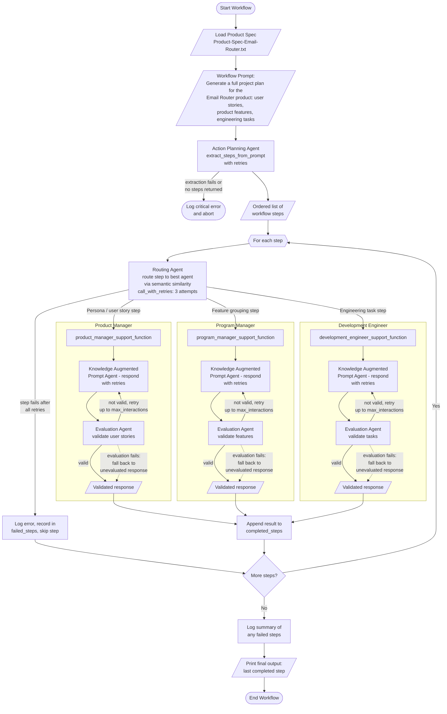

# Reflection on the Agentic Workflow

## Overview

The implemented workflow turns a single high-level prompt — "generate a full
project plan for the Email Router product" — into a structured project plan by
orchestrating specialized agents. An Action Planning Agent decomposes the
prompt into ordered steps, a Routing Agent dispatches each step to the most
suitable persona (Product Manager, Program Manager, or Development Engineer)
via semantic similarity, and each persona pairs a Knowledge Augmented Prompt
Agent (worker) with an Evaluation Agent (validator) that checks the output
against a required structure and requests corrections until it passes.

The full control flow, including the error-handling paths, is captured in the
flowchart below (also maintained in [workflow_flowchart.md](workflow_flowchart.md)):

## Strengths

- **Separation of concerns through personas.** Each role has a narrowly scoped
  persona with explicit "you do NOT" boundaries, which reduces role bleed:
  the Product Manager only writes user stories, the Program Manager only
  groups them into features, and the Development Engineer only defines tasks.
  This produces more consistent, format-compliant output than one generalist
  prompt would.
- **Built-in quality control.** Every worker agent is paired with an
  Evaluation Agent that checks the response against an explicit structural
  contract (e.g. "As a [type of user], I want ... so that ...") and iterates
  with correction instructions until the output passes or `max_interactions`
  is reached. Validation is therefore part of the workflow, not an
  afterthought.
- **Dynamic decomposition and routing.** The Action Planning Agent derives the
  steps from the prompt at runtime rather than from a hard-coded pipeline, and
  the Routing Agent selects the persona per step via embedding similarity. The
  same orchestration would work for a different product spec or a differently
  phrased prompt without code changes.
- **Robustness against transient failures.** Agent calls are wrapped in a
  retry helper (3 attempts with delays), a failed evaluation falls back to the
  unevaluated worker response instead of crashing, an individual failed step
  is logged and skipped rather than aborting the run, and the workflow ends
  with a summary of any failures.

## Limitations

- **The final output is only the last completed step.** The plan's components
  (stories, features, tasks) are produced across separate steps, but only
  `completed_steps[-1]` is printed as "the" result. There is no synthesis
  agent that merges all validated outputs into one coherent project plan, so
  the comprehensiveness of the final artifact depends on what the last step
  happens to contain.
- **No shared state between steps.** Each routed step is answered
  independently: the Program Manager does not automatically receive the user
  stories the Product Manager just produced, and the Development Engineer
  cannot reliably reference real story IDs. Consistency between stories,
  features, and tasks is therefore not guaranteed.
- **Routing is only as good as the route descriptions.** Embedding-based
  routing can misdirect ambiguous steps (e.g. "define the project plan"),
  and there is no route for meta-steps such as consolidation, nor a
  confidence threshold that would flag a poor match instead of forcing a
  choice.
- **Structural rather than semantic evaluation.** The Evaluation Agents check
  format compliance, not factual grounding in the product spec. A well-formed
  but inaccurate user story passes. The evaluation fallback added for
  robustness also means an unvalidated response can silently enter the final
  result (it is logged, but still used).

## Suggested Improvement

**Add shared workflow state plus a final synthesis step.** Concretely: pass
the accumulated `completed_steps` as context into each routed step (e.g.
`routing_agent.route(step, context=completed_steps)` so the support functions
can prepend prior validated outputs to the worker query), and append a fixed
final step that a dedicated synthesis agent — a fourth route with its own
evaluation criteria for a complete project plan — uses to merge all validated
user stories, features, and engineering tasks into one consistent document
with resolved cross-references (features cite the stories they group, tasks
cite real story IDs). This single change addresses the two biggest
limitations at once: the "last step only" output problem and the lack of
consistency between the artifacts produced by the different personas.
