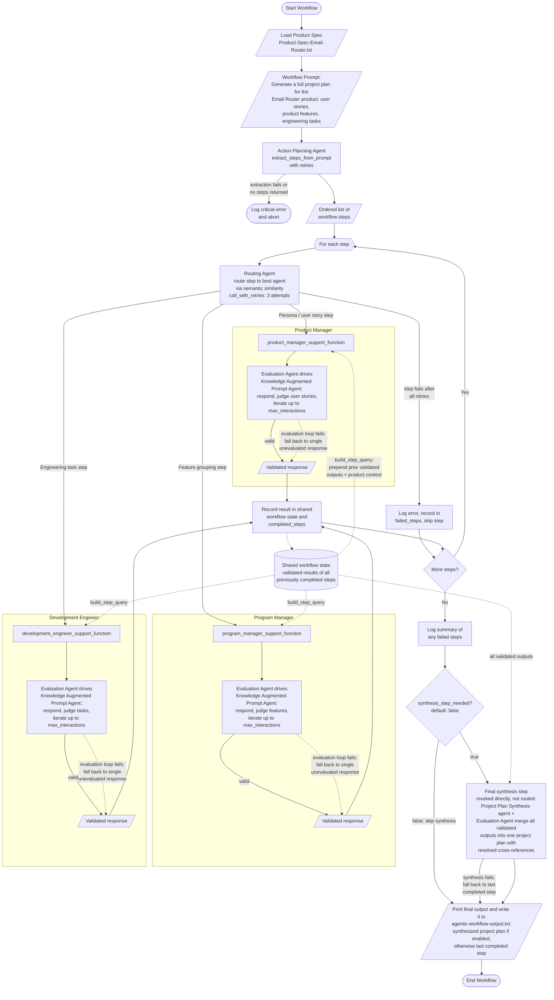

# Reflection on the Agentic Workflow

## Overview

The implemented workflow turns a single high-level prompt — "generate a full
project plan for the Email Router product" — into a structured project plan by
orchestrating specialized agents. An Action Planning Agent decomposes the
prompt into ordered steps, a Routing Agent dispatches each step to the most
suitable persona (Product Manager, Program Manager, or Development Engineer)
via semantic similarity, and each persona pairs a Knowledge Augmented Prompt
Agent (worker) with an Evaluation Agent (validator) that checks the output
against a required structure and requests corrections until it passes.

Two orchestration mechanisms tie the personas together. First, a **shared
workflow state** records every validated step result, and each routed step is
augmented with the product name and all prior validated outputs before it
reaches a worker agent — so the Program Manager groups the actual user stories
the Product Manager wrote, and the Development Engineer defines tasks against
those same stories. All three personas additionally carry the Email Router
product spec in their knowledge, keeping every agent anchored to the same
subject. Second, a **final synthesis step** (invoked directly after the loop,
not via embedding routing, so it can never be misrouted) uses a dedicated
Project Plan Synthesis agent with its own Evaluation Agent to merge all
validated user stories, features, and engineering tasks into one consistent
document with resolved cross-references.

The full control flow, including the error-handling paths, is captured in the
flowchart below (also maintained in [workflow_flowchart.md](workflow_flowchart.md)):

## Strengths

- **Separation of concerns through personas.** Each role has a narrowly scoped
  persona with explicit "you do NOT" boundaries, which reduces role bleed:
  the Product Manager only writes user stories, the Program Manager only
  groups them into features, and the Development Engineer only defines tasks.
  This produces more consistent, format-compliant output than one generalist
  prompt would.
- **Built-in quality control.** Every worker agent is paired with an
  Evaluation Agent that checks the response against an explicit structural
  contract (e.g. "As a [type of user], I want ... so that ...") and iterates
  with correction instructions until the output passes or `max_interactions`
  is reached. Validation is therefore part of the workflow, not an
  afterthought.
- **Shared context keeps the personas on one subject.** All worker agents
  carry the same Email Router product spec in their knowledge, and every
  routed step is prefixed with the validated outputs of all prior steps.
  Features therefore group the stories that were actually written, and tasks
  reference those same stories rather than inventing parallel artifacts.
- **A synthesized, complete final artifact.** A dedicated Project Plan
  Synthesis agent — validated by its own Evaluation Agent against
  completeness and cross-reference criteria — merges all validated outputs
  into one document (numbered user stories, features citing the story IDs
  they group, tasks citing real story IDs), instead of the final output being
  whatever the last step happened to produce.
- **Dynamic decomposition and routing.** The Action Planning Agent derives the
  steps from the prompt at runtime rather than from a hard-coded pipeline, and
  the Routing Agent selects the persona per step via embedding similarity. The
  same orchestration would work for a different product spec or a differently
  phrased prompt without code changes. The synthesis step, by contrast, is
  deliberately invoked directly (not routed) so the consolidation can never be
  misrouted.
- **Robustness against transient failures.** Agent calls are wrapped in a
  retry helper (3 attempts with delays), a failed evaluation loop falls back
  to a single unevaluated worker response instead of crashing, an individual
  failed step is logged and skipped rather than aborting the run, a failed
  synthesis falls back to the last completed step, and the workflow ends with
  a summary of any failures.

## Limitations

- **Routing is only as good as the route descriptions.** Embedding-based
  routing can misdirect ambiguous steps (e.g. "define the project plan"),
  and there is no confidence threshold that would flag a poor match instead
  of forcing a choice.
- **Structural rather than semantic evaluation.** The Evaluation Agents check
  format compliance, not factual grounding in the product spec. A well-formed
  but inaccurate user story passes. The evaluation fallback added for
  robustness also means an unvalidated response can silently enter the final
  result (it is logged, but still used).
- **Context grows with each step.** Because every step and the synthesis
  receive all prior validated outputs plus the product spec, prompt size
  grows over the run. For this spec and model context window that is
  unproblematic, but a much larger spec or longer plan would need
  summarization or selective context (e.g. only pass the artifacts a role
  needs) instead of the full shared state.

## Implemented Improvement

**Shared workflow state plus a final synthesis step** (previously the main
suggested improvement) is now implemented: every support function records its
validated result in a shared `workflow_state`, `build_step_query` prepends the
product context and all prior validated outputs to each routed step, and a
fixed final synthesis step — a dedicated Project Plan Synthesis agent with its
own evaluation criteria for a complete project plan — merges all validated
user stories, features, and engineering tasks into one consistent document
with resolved cross-references. This addressed the two biggest earlier
limitations at once: the "last step only" output problem and the lack of
consistency between the artifacts produced by the different personas.

The synthesis step is gated by a steering flag, `synthesis_step_needed`
(default `True`, overridable via the `SYNTHESIS_STEP_NEEDED` environment
variable), so the workflow output can be compared with and without synthesis:
when the flag is off, the final output is the last completed step; when it is
on, the synthesized project plan is produced. In both cases the final output
is printed and written to `agentic-workflow-output.txt`.

## Suggested Improvement

**Add semantic, spec-grounded evaluation with a routing confidence
threshold.** Extend the Evaluation Agents to check not only structure but also
grounding in the product spec (e.g. "does this story correspond to a
capability actually described in the spec?"), and give the Routing Agent a
minimum similarity threshold below which a step is flagged for review instead
of being force-routed to the closest persona. Together these would close the
remaining gap between format-valid output and factually correct output.
