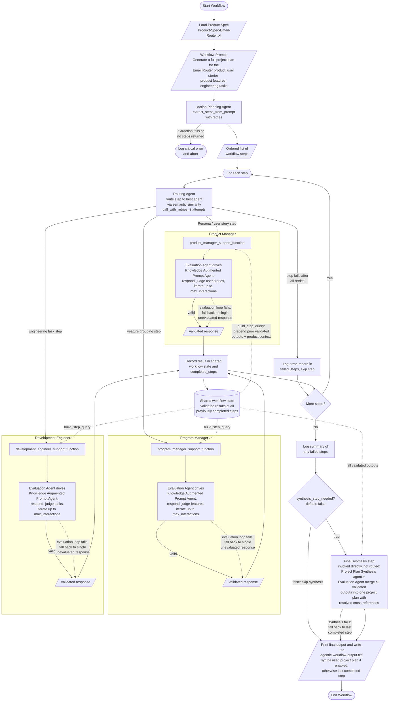

# Agentic Workflow Flowchart

```mermaid
flowchart TD
    Start([Start Workflow]) --> Spec[/Load Product Spec<br/>Product-Spec-Email-Router.txt/]
    Spec --> Prompt[/"Workflow Prompt:<br/>Generate a full project plan for the<br/>Email Router product: user stories,<br/>product features, engineering tasks"/]

    Prompt --> APA[Action Planning Agent<br/>extract_steps_from_prompt<br/>with retries]
    APA -->|extraction fails or<br/>no steps returned| Abort([Log critical error<br/>and abort])
    APA --> Steps[/Ordered list of<br/>workflow steps/]

    Steps --> Loop{{For each step}}
    Loop --> Router[Routing Agent<br/>route step to best agent<br/>via semantic similarity<br/>call_with_retries: 3 attempts]
    Router -->|step fails after<br/>all retries| Skip[Log error, record in<br/>failed_steps, skip step]
    Skip --> More

    Router -->|Persona / user story step| PM_SF[product_manager_support_function]
    Router -->|Feature grouping step| PGM_SF[program_manager_support_function]
    Router -->|Engineering task step| DE_SF[development_engineer_support_function]

    State[(Shared workflow state<br/>validated results of all<br/>previously completed steps)]
    State -.->|build_step_query:<br/>prepend prior validated<br/>outputs + product context| PM_SF
    State -.->|build_step_query| PGM_SF
    State -.->|build_step_query| DE_SF

    subgraph PM [Product Manager]
        PM_SF --> PM_E[Evaluation Agent drives<br/>Knowledge Augmented Prompt Agent:<br/>respond, judge user stories,<br/>iterate up to max_interactions]
        PM_E -->|valid| PM_Out[/Validated response/]
        PM_E -.->|evaluation loop fails:<br/>fall back to single<br/>unevaluated response| PM_Out
    end

    subgraph PGM [Program Manager]
        PGM_SF --> PGM_E[Evaluation Agent drives<br/>Knowledge Augmented Prompt Agent:<br/>respond, judge features,<br/>iterate up to max_interactions]
        PGM_E -->|valid| PGM_Out[/Validated response/]
        PGM_E -.->|evaluation loop fails:<br/>fall back to single<br/>unevaluated response| PGM_Out
    end

    subgraph DE [Development Engineer]
        DE_SF --> DE_E[Evaluation Agent drives<br/>Knowledge Augmented Prompt Agent:<br/>respond, judge tasks,<br/>iterate up to max_interactions]
        DE_E -->|valid| DE_Out[/Validated response/]
        DE_E -.->|evaluation loop fails:<br/>fall back to single<br/>unevaluated response| DE_Out
    end

    PM_Out --> Collect[Record result in shared<br/>workflow state and<br/>completed_steps]
    PGM_Out --> Collect
    DE_Out --> Collect
    Collect -.-> State

    Collect --> More{More steps?}
    More -->|Yes| Loop
    More -->|No| Summary[Log summary of<br/>any failed steps]

    Summary --> Flag{synthesis_step_needed?<br/>default: false}
    Flag -->|false: skip synthesis| Final
    Flag -->|true| Synth[Final synthesis step<br/>invoked directly, not routed:<br/>Project Plan Synthesis agent +<br/>Evaluation Agent merge all validated<br/>outputs into one project plan with<br/>resolved cross-references]
    State -.->|all validated outputs| Synth
    Synth -->|synthesis fails:<br/>fall back to last<br/>completed step| Final
    Synth --> Final[/Print final output and write it to<br/>agentic-workflow-output.txt:<br/>synthesized project plan if enabled,<br/>otherwise last completed step/]
    Final --> End([End Workflow])
```
