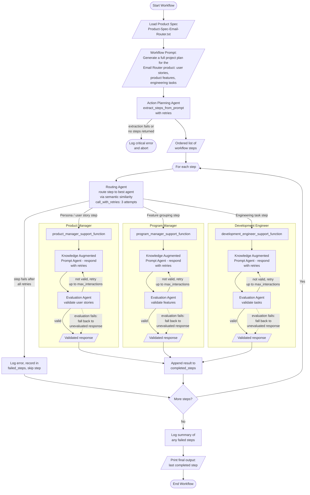

# Agentic Workflow Flowchart

```mermaid
flowchart TD
    Start([Start Workflow]) --> Spec[/Load Product Spec<br/>Product-Spec-Email-Router.txt/]
    Spec --> Prompt[/"Workflow Prompt:<br/>Generate a full project plan for the<br/>Email Router product: user stories,<br/>product features, engineering tasks"/]

    Prompt --> APA[Action Planning Agent<br/>extract_steps_from_prompt<br/>with retries]
    APA -->|extraction fails or<br/>no steps returned| Abort([Log critical error<br/>and abort])
    APA --> Steps[/Ordered list of<br/>workflow steps/]

    Steps --> Loop{{For each step}}
    Loop --> Router[Routing Agent<br/>route step to best agent<br/>via semantic similarity<br/>call_with_retries: 3 attempts]
    Router -->|step fails after<br/>all retries| Skip[Log error, record in<br/>failed_steps, skip step]
    Skip --> More

    Router -->|Persona / user story step| PM_SF[product_manager_support_function]
    Router -->|Feature grouping step| PGM_SF[program_manager_support_function]
    Router -->|Engineering task step| DE_SF[development_engineer_support_function]

    subgraph PM [Product Manager]
        PM_SF --> PM_K[Knowledge Augmented<br/>Prompt Agent - respond<br/>with retries]
        PM_K --> PM_E[Evaluation Agent<br/>validate user stories]
        PM_E -->|not valid, retry<br/>up to max_interactions| PM_K
        PM_E -->|valid| PM_Out[/Validated response/]
        PM_E -.->|evaluation fails:<br/>fall back to<br/>unevaluated response| PM_Out
    end

    subgraph PGM [Program Manager]
        PGM_SF --> PGM_K[Knowledge Augmented<br/>Prompt Agent - respond<br/>with retries]
        PGM_K --> PGM_E[Evaluation Agent<br/>validate features]
        PGM_E -->|not valid, retry<br/>up to max_interactions| PGM_K
        PGM_E -->|valid| PGM_Out[/Validated response/]
        PGM_E -.->|evaluation fails:<br/>fall back to<br/>unevaluated response| PGM_Out
    end

    subgraph DE [Development Engineer]
        DE_SF --> DE_K[Knowledge Augmented<br/>Prompt Agent - respond<br/>with retries]
        DE_K --> DE_E[Evaluation Agent<br/>validate tasks]
        DE_E -->|not valid, retry<br/>up to max_interactions| DE_K
        DE_E -->|valid| DE_Out[/Validated response/]
        DE_E -.->|evaluation fails:<br/>fall back to<br/>unevaluated response| DE_Out
    end

    PM_Out --> Collect[Append result to<br/>completed_steps]
    PGM_Out --> Collect
    DE_Out --> Collect

    Collect --> More{More steps?}
    More -->|Yes| Loop
    More -->|No| Summary[Log summary of<br/>any failed steps]
    Summary --> Final[/Print final output:<br/>last completed step/]
    Final --> End([End Workflow])
```
